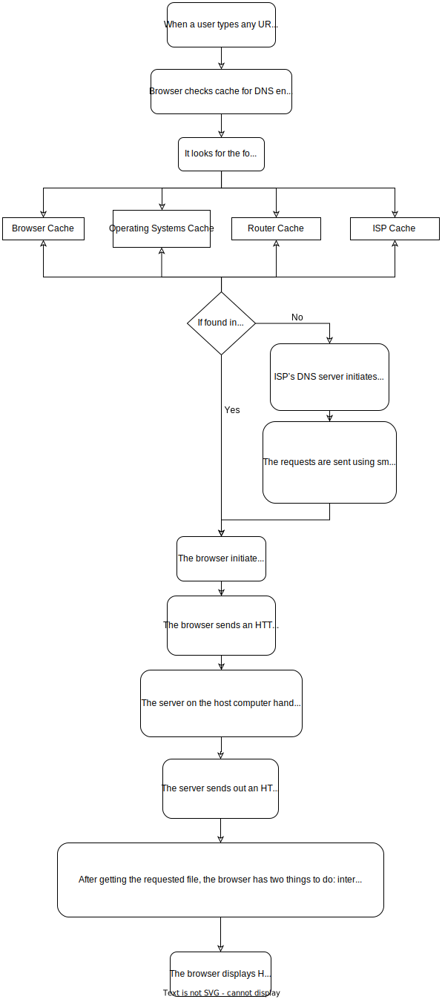

# Pesto Week 1 Assignment Exercise 1.1

# When a user enters an URL in the browser, how does the browser fetch the desired result ? Explain this with the below in mind and Demonstrate this by drawing a diagram for the same.

## What is a browser?

A browser is a group of structured codes that perform a series of tasks to display a web page on the screen. According to their tasks, these codes are made as different components. A browser is a software application used to locate, retrieve and display content on the World Wide Web, including Web pages, images, videos and other files. As a client/server model, the browser is the client run on a computer that contacts the Web server and requests information. The Web server sends the information back to the Web browser which displays the results on the computer or other Internet-enabled device that supports a browser.

## What happens when a user enters an URL in the browser?

When a user type any URL in the web browser, in order to load the page, first it has to find the IP address of the webserver. It asks the Operating System (OS) to check the server name in the local cache. If it is there in the cache, then Rendering Engine renders the web page.

1. Browser checks cache for DNS entry to find the corresponding IP address of the website. It looks for the following cache. If not found in one, then continues checking to the next until found.
   1. Browser Cache
   2. Operating Systems Cache
   3. Router Cache
   4. ISP Cache
2. If not found in the cache, ISP’s (Internet Service Provider) DNS server initiates a DNS query to find the IP address of the server that hosts the domain name. The requests are sent using small data packets that contain information content of the request and the IP address it is destined for.
3. The browser initiates a TCP (Transfer Control Protocol) connection with the server.
4. The browser sends an HTTP request to the web server. GET or POST request.
5. The server on the host computer handles that request and sends back a response. It assembles a response in some format like JSON, XML and HTML.
6. The server sends out an HTTP response along with the status of response.
7. After getting the requested file, the browser has two things to do: interpret and render the HTML page, and obtain the remaining objects (images, flash files, JavaScript files, CSS files, audio, video, etc.) and interpret and display them.
8. The browser displays HTML content.

## What is the main functionality of the browser?

The main functionality of a browser is to retrieve web resources from the server and display it on the web browser window. The web resource is usually an HTML document, but may also be a PDF, image, audio, video or some other type of content.

## High Level Components of a browser.

1. User Interface (UI): It is the layout of elements available for user to interact in the browser window except for the web page itself. The elements for interaction includes address bar, refresh, back, forward, bookmark options and etc.
2. Browser Engine: It is the bridge between the UI and the Rendering Engine. Based on inputs from the UI, it queries HTML document and other resources of a web page into an interactive visual representation on the browser window by manipulating the rendering engine.
3. Rendering Engine: It is the component responsible for displaying the requested content on the browser window. For example, if an HTML page is requested, then it is responsible for parsing HTML document and the CSS and display the parsed and formatted content on the screen. By default, it can display HTML , XML documents and images. It can display other formats of data by using browser plugins and extensions. There are different rendering engines for different browsers. For example, Internet Explorer uses Gecko, Safari uses WebKit, Chrome and Opera (version 15 onwards) uses Blink, an extended implementation of WebKit.
4. Main Flow

   1. Parsing HTML to construct the DOM tree
   2. Render tree construction
   3. Layout of the render tree
   4. Painting the render tree
   5. Networking
   6. UI Backend
   7. JavaScript Interpreter
   8. Data Storage

   ## Rendering engine and it’s use

   It’s able to render the content of given URL in browser screen and interprets the HTML, XML and CSS. It is single threaded. By default, It displays data according to your specified content type (MIME). For Example HTML, Images, XML, CSS, JSON, PDF etc.

   Key operation of Rendering engine is HTML Parser. Each browser use various engines like Chrome and Opera uses Blink, Firefox uses Gecko, IE Edge uses EdgeHTML, Internet Explorer uses Trident, Apple Safari uses WebKit.

   ## Parsers (HTML, CSS, etc)

   The requested content from the networking layer is received in the rendering engine in the binary stream format. The raw bytes are then converted to a character (based upon character encoding) of the HTML file.

   Characters are then converted into tokens. Lexer carries out lexical analysis, breaking input into tokens. During tokenization, every start and end tags in the file are accounted for. It knows out how to strip out irrelevant characters like white space and line breaks. The parser then carries out syntax analysis, applying the language syntax rule to construct a parse tree by analyzing the document structure.

   The parsing process is iterative. It will ask the lexer for a new token and the token will be added to the parse tree if the language syntax rule match. The parser will then ask for another token. If no rule matches, the parser will store the token internally and keep asking for tokens until rule matching all the internally stored token is found. If no rule is found, then the parser will raise the exception. This means the document was not valid and contained syntax errors.

   ## Script Processors

   This includes browser systems and methods of loading/rendering a webpage by processing the web document (HTML page) in parallel. A scanner process scans the web document, identifies scripts, and initiates the downloading of the scripts. As the scripts are downloaded, an HTML parser generates an identifier for each script and the sends the scripts and associated identifiers to a script engine. The script engine parses, analyzes, compiles, and otherwise prepares the scripts for execution in an order that may be different than the execution order of the scripts.

   ## Tree construction

   After the browser has created Nodes from the HTML document, it has to create a tree-like structure of these node objects. Since the elements in the HTML file are nested inside each other, the browser needs to replicate that but using Node objects it has previously created. This will help the browser efficiently render and manage the webpage throughout its lifecycle.

   A DOM tree starts from the topmost element which is html element and branches out as per the occurrence and nesting of HTML elements in the document. Whenever an HTML element is found, it creates a DOM node (Node) object.

   ## Order of script processing

   Scripts with the defer attribute may, on some browsers, not be executed until after the DOM has been fully rendered. Naturally these can't use `document.write`. Similarly there's an `async` attribute that makes the script asynchronous.

   ## Layout and Painting

   The layout (also called reflow) peace will be in charge to calculate the positions and dimensions of each node on the screen. For instance, if you rotate your phone, or if you resize your browser, the layout peace will be executed.

   The inputs are the DOM tree and computed styles. The output is a layout tree with computed layout information.

   1. constructing the layout tree
      The layout tree looks similarly like DOM tree. Difference between them are : 1. First of all, “invisible” elements in the DOM tree won’t be included in the layout tree. For example, an element with `display: none` is excluded from the layout tree. Same as all elements inside of the `<header>` tag. There is an exception: an element with `visibility: hidden;` is in the layout tree. 2. Secondly, some CSS properties add content to the layout. Take a pseudo-class, for example, `div::after {content: ‘I’m here’;}` creates a content included in the layout tree though it is not existing in the DOM tree.
   2. calculating the geometry information
      To paint a box on a blank canvas, we need to know: 1. the starting x, y coordinates, 2. the size of the box 3. Each element in the layout tree is a box.

   In CSS, many properties modify the geometry of an element.

   `float: left; width: 100px; display: absolute;`
   and more…

   The main thread does the heavy lifting for us and completes all the calculations.

   Now we have a layout tree. On the layout tree, each element has precise coordinates and size information.
